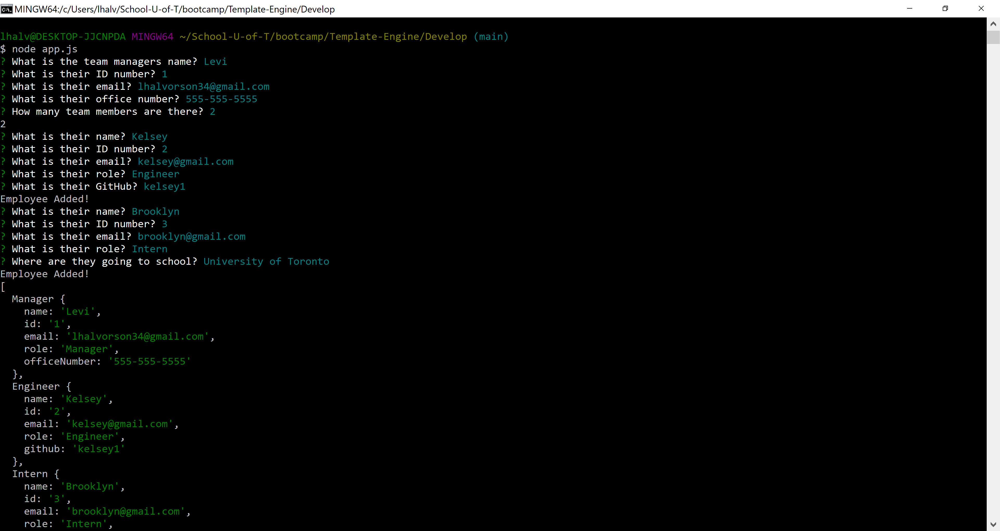
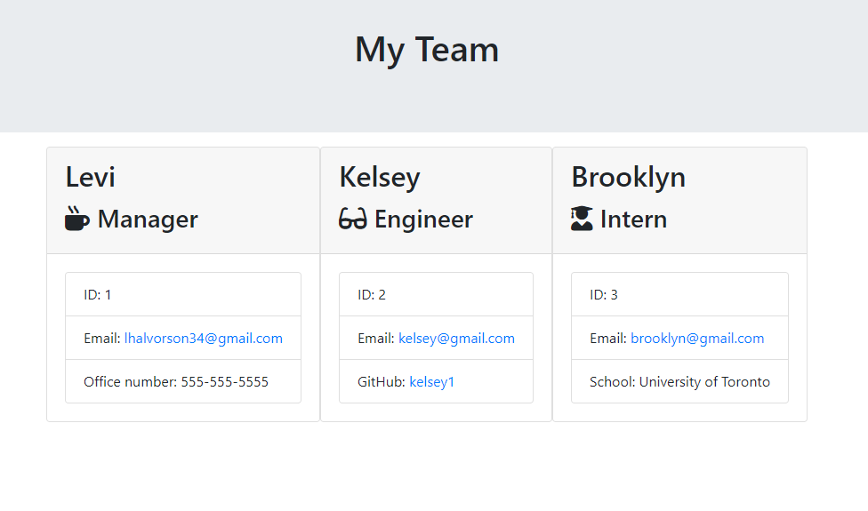

# Template-Engine

## Description

We were asked to create a command line application which will create an HTML file that displays a nicely formatted team roster based on the information provided by the user. The main focus of buiding this code was to utilize object oriented programming. Jest was used to conduct testing on the javascript files, fs and path were used for creating/reading files.

## Issues

The main challenges were getting used to using OOP and getting everything to work together in an efficient way. Jest was also a setback when trying to pass all provided tests. Jest really helped me understand this code at a deeper level when troubleshooting failed tests.

## Collaborators

With instruction from Fil and Daniel.

---

[Filipe Laborde-Basto's](https://github.com/c0dehot) GitHub.

---

[Daniel Cabellos](https://github.com/shibeknight) GitHub.

---

## Questions:

For questions about this project you can go to my GitHub page at the following link:

- [GitHub Profile](https://github.com/Halvosaurus34)

For additional questions please reach out to me at: lhalvorson34@gmail.com.

---

## Links

[Template Engine Video Presentation](https://drive.google.com/file/d/1HFWV4gni13xcPLAIDkZO8lgTiO9KZ8ke/view?usp=sharing)

---

[Template Engine GitHub Repository](https://github.com/Halvosaurus34/Template-Engine)

---

I used [Font Awesome](https://fontawesome.com/) for the Icons.

---

I also used [Bootstrap](https://getbootstrap.com/).

## Screenshots

---

---
